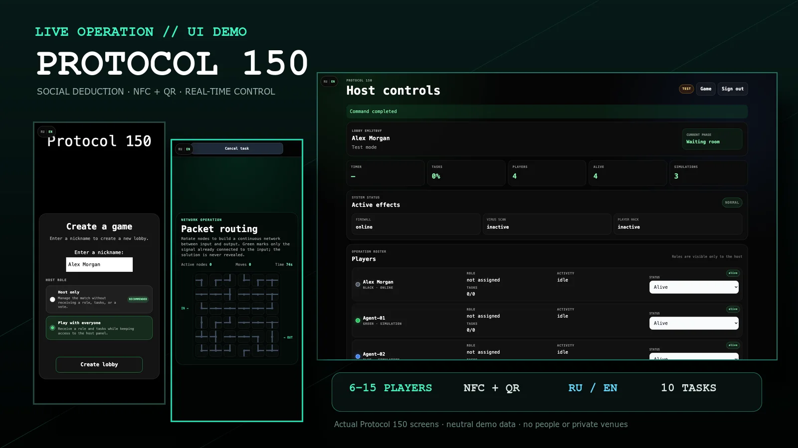
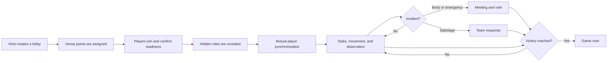
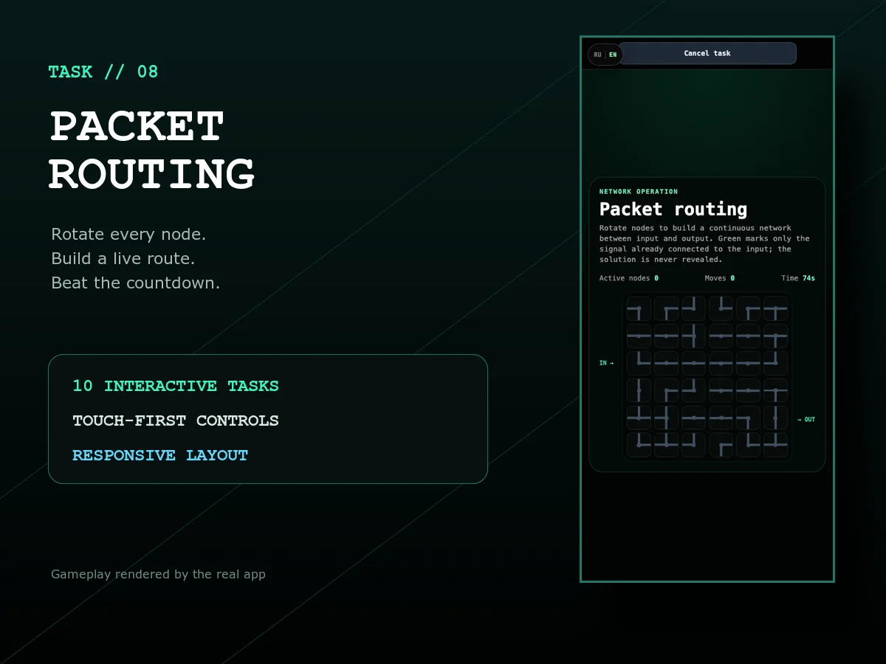
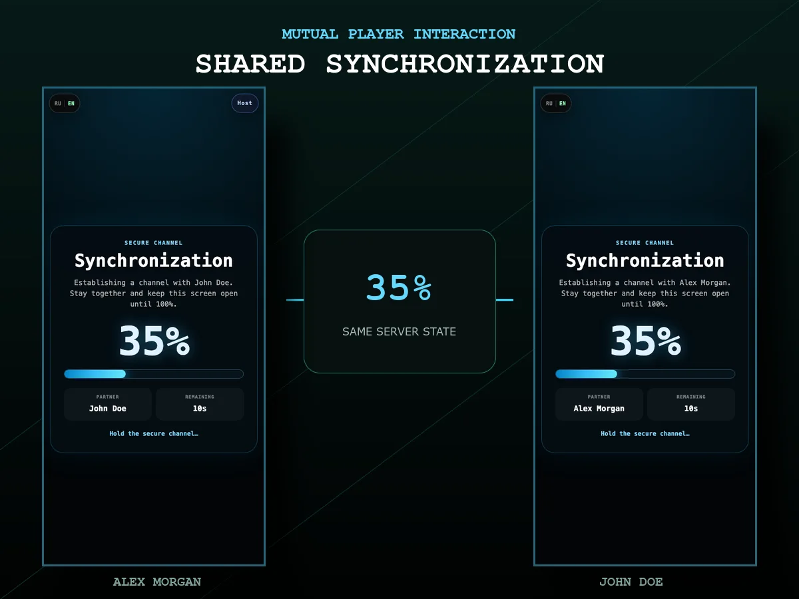
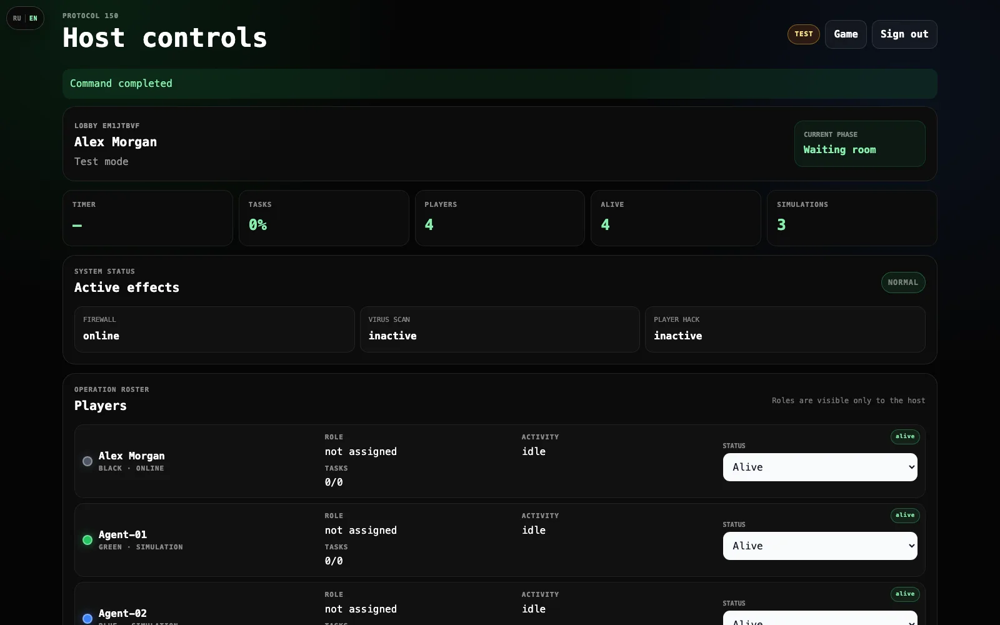
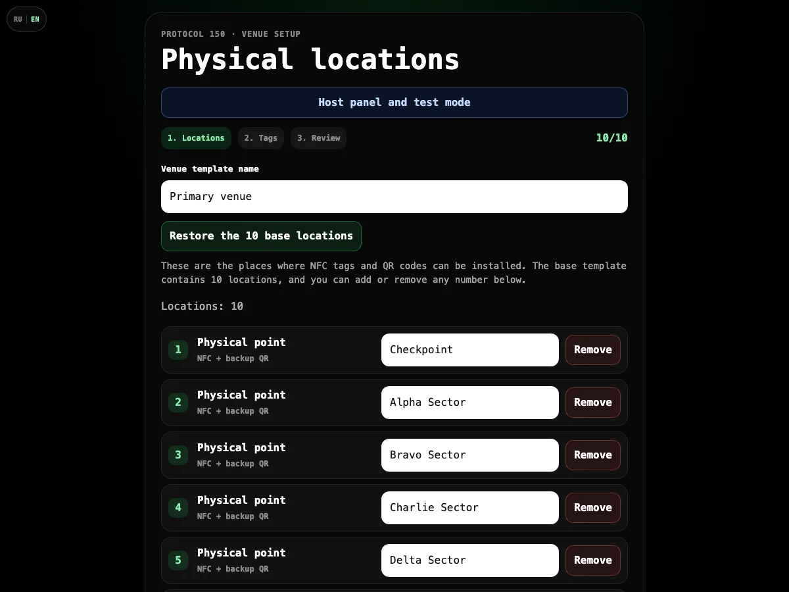
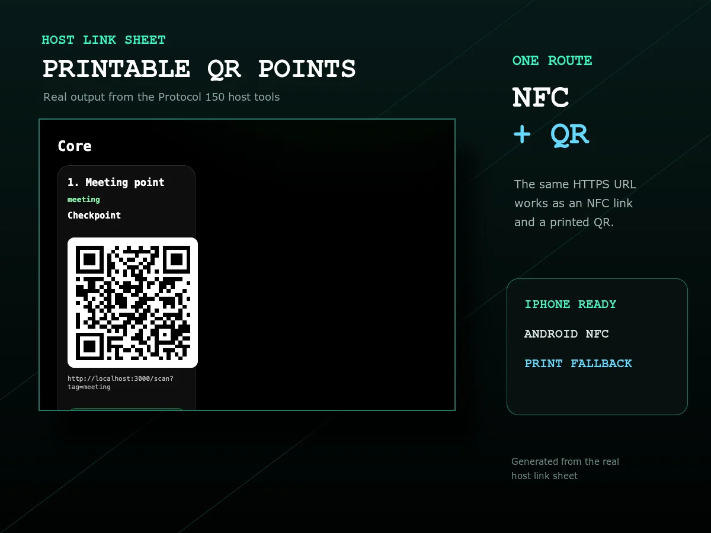
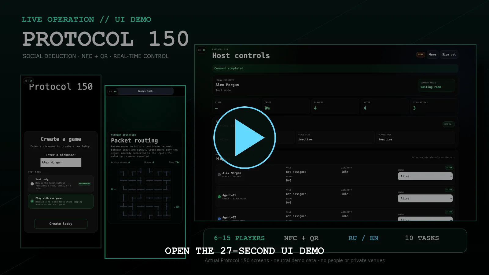
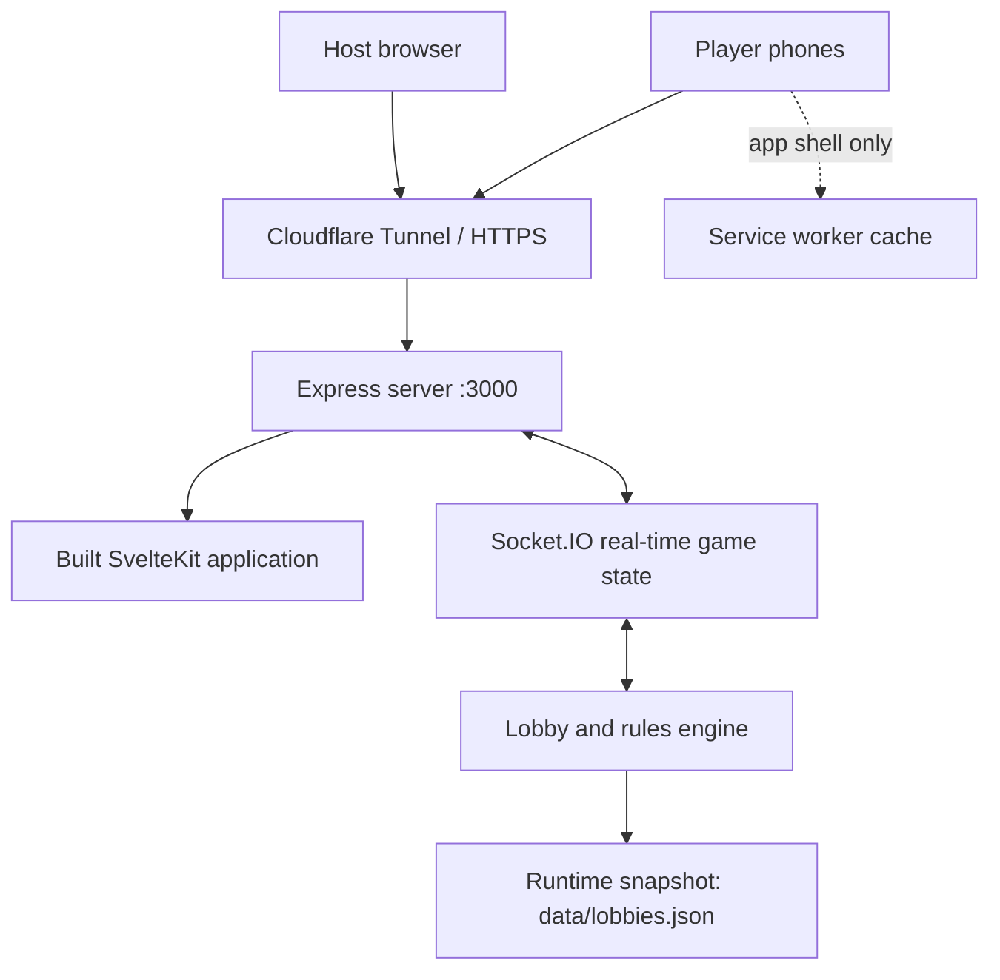

<div align="center">
  

  # Protocol 150

  **A mobile-first live-action spy game built around social deduction, physical movement, and covert player interaction.**

  [](#project-status)
  [](#gameplay)
  [](#key-features)
  [](#nfc-and-qr)
  [](#requirements)
</div>

<p align="center">
  
</p>

> [!IMPORTANT]
> Protocol 150 is designed for supervised private games at a prepared physical venue. Run a safety briefing, remove physical hazards, and tell players not to run before every session.

## Overview

Protocol 150 turns a house, office, event space, or other indoor venue into a live spy operation. Players move between real locations, scan NFC tags or QR codes, complete interactive tasks, and try to identify infiltrated agents hiding inside the team.

Most participants are **Operatives**. They complete assignments, respond to sabotage, report eliminated players, and vote during meetings. A smaller hidden group becomes **Infiltrated Agents**. They blend into the operation, fake tasks, launch sabotage, and hide an instant elimination gesture inside an ordinary player interaction.

The repository is named `live-action-spy-game`; the public game title remains **Protocol 150**.

## Contents

- [Key features](#key-features)
- [Gameplay](#gameplay)
- [Roles and objectives](#roles-and-objectives)
- [Player synchronization](#player-synchronization)
- [Tasks and physical points](#tasks-and-physical-points)
- [Venue preparation](#venue-preparation)
- [NFC and QR](#nfc-and-qr)
- [Host panel](#host-panel)
- [Media](#media)
- [Quick start](#quick-start)
- [Configuration](#configuration)
- [Cloudflare Tunnel](#cloudflare-tunnel)
- [Testing](#testing)
- [Architecture](#architecture)
- [Troubleshooting](#troubleshooting)
- [Project status](#project-status)

## Key features

- Real-time multiplayer state powered by Socket.IO.
- One responsive web application for phones, tablets, and desktop host screens.
- NFC and QR open the same secure scan URL, so QR is always available as a fallback.
- English and Russian interfaces with instant language switching.
- Unicode player names, including Cyrillic and Latin characters.
- Two host modes: dedicated host or host who also participates.
- Editable venue templates with a ready-to-use ten-location starting layout.
- Fifteen configurable physical activity points plus an optional secret-task point.
- Ten interactive minigames with a separate host-side test launcher.
- Mandatory mutual player scanning before personal tasks unlock.
- A server-authorized covert interaction: tap the neutral player button for a safe synchronization or hold it for 0.7 seconds to eliminate when the cooldown is ready.
- Emergency meetings, body reports, voting, ghost mode, sabotage, and two-team victory conditions.
- A protected host panel with venue preflight, pause, recovery, diagnostics, test tools, and manual match controls.
- Runtime lobby snapshots for recovery after an accidental server restart.
- A conservative service worker that caches the application shell without caching Socket.IO or live match state.

## Gameplay

### At a glance

| Item | Current behavior |
| --- | --- |
| Recommended group | 6–15 participating players |
| Teams | Operatives and Infiltrated Agents |
| Host | Dedicated host or participating host |
| Player device | One modern phone browser per player |
| Physical interaction | NFC tag or QR scan |
| Required opening action | Mutual scan and synchronized 15-second interaction |
| Main loop | Move, scan, complete tasks, observe, discuss, and vote |
| Sabotage | Firewall breach and virus scan |
| Languages | English and Russian |

### Round flow



<details>
<summary><strong>Suggested live-game briefing</strong></summary>

1. Do not run, push, block doors, or move venue objects.
2. Let other players scan your personal tag when requested.
3. Remain together until a synchronization reaches 100%.
4. Never reveal another player's screen.
5. Dead players remain silent and do not help living players outside meetings.
6. Use the same public game address on every device.
7. If NFC fails, scan the QR code printed next to the tag.

</details>

## Roles and objectives

### Operatives

Operatives win by completing enough team task progress or by identifying and removing every infiltrated agent.

They must:

- complete one mutual synchronization before personal tasks unlock;
- scan physical task points and finish the assigned minigames;
- respond to firewall sabotage at both defense terminals;
- stop moving when a virus scan is active;
- report a body by scanning the eliminated player's tag;
- discuss evidence and vote during meetings.

### Infiltrated Agents

Infiltrated Agents win when they gain numerical control or when a decisive sabotage succeeds.

They can:

- move through the same venue and imitate ordinary task behavior;
- launch sabotage after the server-controlled cooldown;
- begin a normal-looking synchronization with another player;
- scan an idle or task-busy operative and hold the same neutral interaction button for 0.7 seconds to eliminate instantly;
- tap that button normally to begin a real safe synchronization if they want to avoid suspicion;
- participate in discussion and redirect suspicion.

An agent cannot eliminate another agent. A dedicated host has no role, tasks, vote, readiness requirement, or effect on team balance.

## Player synchronization

Player interaction uses the same neutral scan screen for every role, so approaching another player does not immediately reveal an agent.

1. Player A scans Player B's personal NFC tag or QR code.
2. A normal tap sends a safe synchronization request.
3. Player B has 30 seconds to scan Player A and accept with the same normal tap.
4. Both devices open the same progress screen.
5. The synchronization runs for 15 seconds and shows a shared percentage.
6. Completion unlocks tasks for both players; synchronization itself can never eliminate either participant.

The active interaction cannot be cancelled midway. A meeting, match pause, or game end safely interrupts it. Test mode shortens the synchronization to three seconds.

When the normal kill cooldown has expired, an agent can instead hold that visually identical neutral button for 0.7 seconds. The target is eliminated immediately after the server confirms the uninterrupted hold; no prior synchronization or limited-use charge is required. Releasing early performs the ordinary safe tap, while pointer cancellation or leaving the button cancels the hidden attempt. The server rejects shortened, stale, mismatched, teammate-targeted, paused, or otherwise invalid attempts. A meeting, pause, disconnect, role change, death, task start, restart recovery, or game end clears every pending hold. NFC and direct-opening QR codes use the same server state, so neither scan method bypasses these checks.

## Tasks and physical points

Protocol 150 currently contains ten task types:

| Task | Interaction |
| --- | --- |
| Sequence Relay | Memorize and reproduce an increasingly difficult signal sequence |
| Signal Interception | Complete a multi-point interception across three venue locations |
| Password Crack | Solve a password-based terminal challenge |
| Hash Reactor | Keep timed inputs inside a changing target window |
| Virus Cleanup | Identify and eliminate hostile targets under pressure |
| Sum to One Hundred | Build the correct numerical combination |
| Evidence Disposal | Destroy selected evidence while avoiding incorrect targets |
| Packet Routing | Construct a valid route through a network |
| Access Log Analysis | Inspect records and identify suspicious access |
| Power Grid | Stabilize a changing power network |

The default venue uses fifteen activity points:

- one meeting point;
- one Sequence Relay point;
- three Signal Interception points;
- one point for each of the other eight tasks;
- two firewall defense terminals;
- one optional additional tag for the secret task.

The host can place multiple points in the same room or distribute them across a larger venue.

## Venue preparation

The venue setup screen starts with a privacy-safe ten-zone example:

1. Checkpoint
2. Alpha Sector
3. Bravo Sector
4. Charlie Sector
5. Delta Sector
6. Communications Hub
7. Analysis Center
8. Technical Bay
9. Briefing Zone
10. Observation Post

These fictional labels do not describe a real building or reveal a private floor plan. Every location can be renamed, added, or removed locally by the host. The host then assigns all activity points to the available locations and saves the template in that browser.

Previously saved venue templates are retired automatically when this privacy-safe template is first loaded. Real room names should remain local operational data and should never be added to source code, screenshots, or public documentation.

### Recommended physical kit

- one or two personal tags per player;
- ordinary NTAG213 stickers for non-metal surfaces;
- separate On-Metal or Anti-Metal NFC tags for metal surfaces;
- one printed QR backup beside every NFC point;
- removable labels or holders for task names and room placement;
- a charger or power bank for the host device;
- a stable Wi-Fi or mobile internet connection.

Open `/adminlinks` after the public hostname and venue are ready. It generates the complete URL and QR code for every activity point and player color.

The QR URL includes `source=qr`, while the URL intended for an NFC NDEF record includes `source=nfc`. Both open the same `/scan` route and trigger the same game action. The source marker only lets the host preflight panel record which physical method was tested.

## NFC and QR

NFC and QR are two entry methods for the same route:

```text
https://your-game-host.example/scan?tag=...
```

Write the complete HTTPS address to NFC as an **NDEF URL/URI record**. Do not write only a short value such as `player:green`; phones that use system-level NFC reading need a real web address to open the game.

Browser support for in-page Web NFC varies by device and browser. QR therefore remains the universal fallback. Test every physical point on the actual devices that will be used at the event.

> [!WARNING]
> Do not permanently lock NFC tags as read-only until the final stable hostname, printed QR set, and complete physical test have all been confirmed.

Avoid placing ordinary inlay tags directly on metal, batteries, pipes, appliance bodies, or metal-backed mirrors. Use dedicated On-Metal tags in those locations.

## Host panel

The lobby creator can open `/admin` through the saved creator session. A separate global technical login is available through `ADMIN_SECRET`.

The panel provides:

- live lobby, phase, player, connection, role, task, cooldown, and sabotage status;
- a venue-preflight tab with QR/NFC coverage, player connectivity, HTTPS, hostname, and Wake Lock diagnostics;
- automatic point verification when a connected player scans a generated QR or NFC link before the match;
- manual verification fallback plus venue JSON import and export;
- pause and resume with server-side timer freezing;
- emergency sabotage stop;
- controlled phase advancement and reset-to-lobby;
- manual player status correction;
- forced operative or agent victory;
- a test venue and simulated players;
- shortened timers in test mode;
- role editing for test players;
- cooldown reset, task-progress simulation, meeting simulation, and sabotage simulation;
- direct launch buttons for all ten minigames without changing match progress;
- the latest 100 game events for diagnostics.

Keep `ADMIN_SECRET` private. Players do not need it, and the normal creator session should be used for everyday hosting.

### Host-only versus participating host

| Mode | Receives a role | Completes tasks | Votes | Counts for balance |
| --- | ---: | ---: | ---: | ---: |
| Host only | No | No | No | No |
| Host participates | Yes | Yes | Yes | Yes |

## Media

Every image below was captured from the real application using neutral demo identities and fictional venue labels. The presentation contains no people, private rooms, personal notifications, tunnel addresses, or production credentials.

<table>
  <tr>
    <td width="50%"></td>
    <td width="50%"></td>
  </tr>
  <tr>
    <td align="center"><strong>Interactive mobile tasks</strong></td>
    <td align="center"><strong>Real two-client synchronization</strong></td>
  </tr>
  <tr>
    <td></td>
    <td></td>
  </tr>
  <tr>
    <td align="center"><strong>Live host controls</strong></td>
    <td align="center"><strong>Privacy-safe venue templates</strong></td>
  </tr>
</table>

<p align="center">
  
</p>

### Short UI demo

<p align="center">
  <a href="./docs/media/video/protocol-150-demo.mp4">
    
  </a>
  <br>
  <sub>Click the cover to open the 27-second, 1280 × 720 MP4 demo.</sub>
</p>

See the [media guide](./docs/media/README.md) for the asset list, capture rules, and replacement workflow.

## Quick start

### Requirements

- Node.js 20 or newer
- npm
- a current desktop browser for setup and hosting
- modern phone browsers for players
- HTTPS for public phone access and NFC web links

### Install

```bash
npm install
npm install --prefix server
cp .env.example .env
```

For a normal same-origin build, leave `PUBLIC_SERVER` empty. Change `ADMIN_SECRET` before exposing the server to the internet.

### Build and run

```bash
npm run build
npm start --prefix server
```

The production server serves both the built frontend and Socket.IO from:

```text
http://localhost:3000
```

Only one public tunnel and one public URL are required.

### Stop

Press `Ctrl+C` in the terminal running the server.

## Configuration

Configuration is loaded from the root `.env` file.

| Variable | Default | Purpose |
| --- | --- | --- |
| `PUBLIC_SERVER` | empty | Socket.IO origin embedded into the frontend build. Keep empty for the recommended same-origin setup. |
| `PUBLIC_DEV_MODE` | `false` | Enables browser-side development helpers. Never enable for a real game. |
| `PUBLIC_MIN_PLAYERS` | `6` | Minimum player count shown by the frontend. Keep aligned with `MIN_PLAYERS`. |
| `PORT` | `3000` | Express and Socket.IO server port. |
| `MIN_PLAYERS` | `6` | Server-enforced minimum participating player count. |
| `DEV_MODE` | `false` | Enables server-side development behavior. Never enable for a real game. |
| `ADMIN_SECRET` | example placeholder | Global technical password for access to all active lobbies. |
| `ALLOWED_ORIGINS` | empty | Comma-separated frontend origins when frontend and backend are deliberately hosted separately. |
| `LOBBY_STATE_FILE` | `data/lobbies.json` | Optional absolute path for persisted lobby state, backups, or isolated test instances. |

Recommended production-style local configuration:

```dotenv
PUBLIC_SERVER=
PUBLIC_DEV_MODE=false
PUBLIC_MIN_PLAYERS=6

PORT=3000
MIN_PLAYERS=6
DEV_MODE=false
ADMIN_SECRET=replace-with-a-long-random-secret
ALLOWED_ORIGINS=
```

Environment variables prefixed with `PUBLIC_` are included at frontend build time. Rebuild after changing them.

<details>
<summary><strong>Two-process development mode</strong></summary>

For local browser development, allow the Vite origin:

```dotenv
PUBLIC_SERVER=http://localhost:3000
ALLOWED_ORIGINS=http://localhost:5173
```

Run the backend:

```bash
npm run dev --prefix server
```

Run the frontend in a second terminal:

```bash
npm run dev -- --host 0.0.0.0
```

Use the single-process production build for multi-phone and NFC/QR testing. It avoids mixed origins and more closely matches the real event environment.

</details>

<details>
<summary><strong>Fast test configuration</strong></summary>

For a private local rehearsal only:

```dotenv
PUBLIC_DEV_MODE=true
DEV_MODE=true
PUBLIC_MIN_PLAYERS=1
MIN_PLAYERS=1
```

Rebuild and restart after changing the values. Test mode inside `/admin` is safer for normal rehearsals because its shortened timers apply only to the selected lobby.

</details>

## Cloudflare Tunnel

Keep the Node server on local HTTP and let Cloudflare provide the public HTTPS endpoint.

### Temporary tunnel

With the production server running:

```bash
cloudflared tunnel --url http://localhost:3000
```

Open the generated HTTPS address on every device.

> [!CAUTION]
> A Quick Tunnel address changes when the tunnel is recreated. Previously printed QR codes and programmed NFC tags will then point to the old address. Use a named tunnel and stable hostname before producing the final physical set.

Do not mix `localhost`, a local network address, and the public tunnel address during one match. The lobby, Socket.IO connection, QR codes, and NFC links should all use the same origin.

## Testing

Run the low-cost validation suite before a physical rehearsal:

```bash
npm run check
npm test
npm run build
```

The server tests cover critical multiplayer rules including:

- a complete five-player operation with a dedicated host, all sabotage types, a covert elimination, body report, meeting, voting, and victory;
- mutual player synchronization;
- safe synchronization with no hidden elimination outcome;
- server-timed 0.7-second elimination holds, early cancellation, shared cooldown, and task-station release;
- interruption of synchronization and pending holds by meetings;
- agent-to-agent protection;
- firewall and virus sabotage;
- body reports;
- host-only participation rules;
- pause and lobby persistence behavior;
- venue import validation, unique physical tags, and QR/NFC preflight persistence;
- enabled UI buttons having action handlers and all ten standard minigames reaching their completion route.

Automated checks cannot verify NFC antenna placement, camera focus, browser permissions, Wi-Fi coverage, or real-world responsive layout. Those require a physical multi-device pass.

## Architecture



### Technology

- **Frontend:** SvelteKit, Svelte, TypeScript, Vite
- **Realtime:** Socket.IO
- **Backend:** Node.js and Express
- **Physical entry:** QR and NDEF URL-based NFC
- **Public transport:** Cloudflare Tunnel
- **Persistence:** local runtime lobby snapshots

### Project layout

```text
live-action-spy-game/
├── src/
│   ├── lib/                 shared UI, stores, translations, and venue setup
│   ├── routes/              player, host, scan, meeting, and minigame screens
│   └── service-worker.ts    conservative application-shell caching
├── server/
│   ├── index.js             Socket.IO events and server entry point
│   ├── lobbies.js           game phases and multiplayer rules
│   ├── player.js            player state
│   ├── persistence.js       runtime lobby snapshots
│   └── lobbies.test.js      server rule tests
├── static/                  public icons and static assets
├── docs/media/              screenshot and video capture kit
├── .env.example             documented configuration template
└── README.md
```

## Event-day checklist

<details>
<summary><strong>Before players arrive</strong></summary>

- [ ] Build and start the production server.
- [ ] Start the stable HTTPS tunnel.
- [ ] Confirm that `/admin`, `/adminlinks`, and the home page open.
- [ ] Open **Venue preflight** in `/admin` and clear old verification marks.
- [ ] Walk through every task point with NFC and QR.
- [ ] Confirm that the preflight panel records every QR point; NFC is optional only when QR will be the planned fallback.
- [ ] Test both firewall terminals.
- [ ] Test two-way player synchronization with two real phones.
- [ ] Check the meeting point and body-report flow.
- [ ] Verify the host-only or participating-host selection.
- [ ] Confirm that all phones stay connected in every room.
- [ ] Charge the host device and keep a power source nearby.
- [ ] Remove trip hazards and brief players not to run.

</details>

<details>
<summary><strong>After the game</strong></summary>

- [ ] End or reset the match from the host panel.
- [ ] Stop the Node server and temporary tunnel.
- [ ] Collect reusable tags and signs.
- [ ] Record device-specific layout or scanning problems.
- [ ] Save useful screenshots or video clips for the media gallery.

</details>

## Troubleshooting

<details>
<summary><strong>A phone opens the site but does not join the live game</strong></summary>

Make sure the application and Socket.IO use the same public hostname. In the recommended production setup, keep `PUBLIC_SERVER` empty, rebuild, restart, and open only the tunnel URL.

</details>

<details>
<summary><strong>NFC does nothing on a device</strong></summary>

Use the QR fallback first. Then confirm that the tag contains a complete HTTPS URL as an NDEF URL/URI record, is not placed directly on metal, and opens correctly outside the game. Browser-level NFC scanning is not available on every platform.

</details>

<details>
<summary><strong>Old QR codes or NFC tags open the wrong address</strong></summary>

The Quick Tunnel hostname changed. Start the previous tunnel if it is still available, or regenerate `/adminlinks` and reprogram/reprint the physical set. A named tunnel with a stable hostname prevents this.

</details>

<details>
<summary><strong>The host panel rejects the password</strong></summary>

Set `ADMIN_SECRET` in the root `.env`, restart the server, and enter the same value at `/admin`. The lobby creator normally authenticates through the saved creator session and does not need the global secret.

</details>

<details>
<summary><strong>The server restarted during a match</strong></summary>

The server writes runtime lobby snapshots to `data/lobbies.json` and attempts to restore them on startup. Players should reopen the same public address and let their saved browser session reconnect. Do not delete browser storage or the runtime snapshot while attempting recovery.

</details>

<details>
<summary><strong>A service-worker update appears stale</strong></summary>

Reload the application after the new build is deployed. If a device remains on an old shell, close all game tabs and reopen the public URL. Live Socket.IO state is never intentionally cached.

</details>

## Security and privacy

- Never commit `.env` or publish `ADMIN_SECRET`.
- Use HTTPS for any public session.
- Keep `ALLOWED_ORIGINS` restricted when running split frontend/backend development.
- Do not expose the host panel password to players.
- Avoid filming names, faces, private rooms, or phone notifications without consent.
- Treat lobby snapshots as temporary operational data.

## Project status

Protocol 150 is in **active development** and is suitable for controlled rehearsals rather than unattended public deployment.

Current focus:

- multi-device responsive verification;
- balancing minigame difficulty and match pacing;
- physical NFC and printed QR validation;
- stronger venue preparation tools;
- real-session photography and a short gameplay demo;
- continued host-panel and sabotage testing.

When reporting a problem, include the device model, browser, screen orientation, current route, number of connected players, and the relevant host event-log entry.
